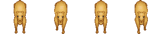
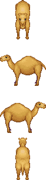

# 动画

* * *

这一次给各位介绍的是BKE的动画类，它包含了 `animate` 、 `action` 与 `trans` 。三者都是在BKE中制作动画时必不可缺的组成部分。 虽然实际说来三者其实是不同的三个类，不过考虑到功能划分，我们这一次就先对 `animate` 类先进行说明。

## animate

顾名思义，`animate` 命令常被用于创建逐帧动画时使用，您可以利用此命令来创建一个循环播放的动画。

其命令格式如下：

  **animate** _*mode_  
    动画系命令关键字。

   _mode_  
    接下来执行动画命令的类型。  

`animate` 命令有6种不同的模式（mode关键字），它们分别是：

    horizontal vertical multfiles start cell stop

对于不同的 `mode` ， `animate` 命令有不同的参数，这里就向大家顺序介绍一下：

  **animate** _*mode="horizontal" *index *file *frame interval loop_  
    动画系命令，模式为剪裁方式（动画帧水平排列）。

   _index_  
    创建的动画的编号（和精灵共用一个编号集合）。  
   _file_  
    读取的文件。  
   _frame_  
    动画的帧数。  
   _interval_  
    每帧的间隔，默认为33（30fps）。  
   _loop_  
    动画循环模式，值有 "none"（不循环），"forword"（单向循环），"bouncing"（布朗斯循环）。  

* * *

  **animate** _*mode="vertical" *index *file *frame interval loop_  
    动画系命令，模式为垂直模式（动画帧垂直排列）。

   _index_  
    创建的动画的编号（和精灵共用一个编号集合）。  
   _file_  
    读取的文件。  
   _frame_  
    动画的帧数。  
   _interval_  
    每帧的间隔，默认为33（30fps）。  
   _loop_  
    动画循环模式，值有 "none"（不循环），"forword"（单向循环），"bouncing"（布朗斯循环）。  

<table width="600" border="0" cellspacing="2" cellpadding="0">

<tbody>

<tr>

<td width="56" height="40" align="right" class="STYLE1">+</td>

<td width="544" height="40" class="dotline">[不同循环模式的说明](javascript:void(null))</td>

</tr>

<tr id="LM1" style="DISPLAY: none">

<td height="30" align="right" bgcolor="#f5f9ed">_</td>

<td height="30" bgcolor="#f5f9ed">在假定一个动画文件有4帧的情况下：  
  不循环：顾名思义，动画将不会循环，仅仅只是按顺序1-2-3将动画播放一次后停止。  
  单向循环：动画会按照1-2-3-4｜1-2-3-4｜1-2-3-4这样的顺序来循环播放，在播放完最后一帧后重新跳转到第一帧。  
  布朗斯循环：在没有delay的情况下，动画会按照1-2-3-4-3-2-1-2-3-4的顺序循环；如果在有delay的情况下，动画则会按照1-2-3-4-3-2-1｜2-3-4-3-2-1｜2-3-4-3-2-1这样的顺序循环。  
</td>

</tr>

</tbody>

</table>

在这里我们准备了两张不同的素材，以分别对应两种不同的剪裁模式：

文件一对应了 `horizontal` 模式，而文件二对应的则是 `vertical` 模式。可以直观的看出前者是横向剪裁，后者则是竖向剪裁。

请您先将这两个文件保存下来，在之后的示例中我们将会使用到它。

接下来我们继续介绍剩余的模式：

  **animate** _*mode="multifiles" *index *file interval loop delay_  
    从多个文件创建一个动画。

   _index_  
    创建的动画的编号（和精灵共用一个编号集合）。  
   _file_  
    将要添加的文件列表。  
   _interval_  
    每帧的间隔，默认为33（30fps）。  
   _loop_  
    动画是否循环，默认为 false 。  
   _delay_  
    动画每次循环之间的间隔 。  

* * *

  **animate** _*mode="start" *index_  
    开始一个动画。

   _index_  
    欲开始的动画的编号（和精灵共用一个编号集合）。  

  **animate** _*mode="stop" *index_  
    停止一个动画。

   _index_  
    欲停止的动画的编号（和精灵共用一个编号集合）。  

* * *

  **animate** _*mode="cell" *index *frame_  
    切换动画到某一帧（会停止动画）。

   _index_  
    欲更改的动画的编号（和精灵共用一个编号集合）。  
   _file_  
    欲更改动画到哪一帧。  

    请注意， `start` 仅仅只能作用于单个精灵，不能传入数组作为参数。

在介绍完 `animate` 类所有的 `mode` 之后，让我们来练练手吧！

首先请将下面的图片保存到您的硬盘上：

    

接着，您可以直接复制下面的代码，保存编译之后运行以查看它的作用，不过我还是推荐您自己先写一遍 :)

    *main
    @layer index=10 width=800 height=600 color=0xFFFFFF opacity=255
    @addto index=10 target=basic_layer
    @wait time=1000 canskip=false

    @animate mode="horizontal" index=2 file="rakuda-1" frame=4 interval=180 loop="forward"
    @addto index=2 target=10 zorder=10 pos=[250,280]
    @animate mode="start" index=2
    @wait time=1000 canskip=false

    @animate mode="vertical" index=3 file="rakuda-3" frame=4 interval=360 loop="forward"
    @addto index=3 target=10 zorder=10 pos=[350,280]
    @animate mode="start" index=3
    @wait time=1000 canskip=false

    @animate mode="multifiles" index=4 file=["ch-1","ch-2","ch-3"] interval=360 loop="true" delay=500
    @addto index=4 target=10 zorder=10 pos=[400,280]
    @animate mode="start" index=4
    @wait time=2000 canskip=false

    @animate mode="stop" index=2
    @animate mode="cell" index=3 frame=2

首先，我们使用两张连续的图片创建了两个动画，分别对应的是横向剪裁模式与竖向剪裁模式。在每一次创建结束后，我们都使用了 `start` 模式来开始对应的动画，如果我们不使用 `start` 命令，对应的动画则不会开始播放，请注意。

接下来我们使用了 `muiltfiles` 模式，以三张独立的图片创建了一个动画。这里需要说明的是，在 `muiltfiles` 模式中， `interval` 这个参数负责控制帧与帧之间的间隔时间，而 `delay` 参数则用于控制每次循环与循环之间的间隔时间。您可以自行修改 `delay` 的大小来体会。

在最后两行命令中，我们停止了编号为2的动画文件的播放，使编号为3的动画切换到了第2帧（注意，这样做会停止动画的播放）。

以上就是 `animate` 类的所有命令了，怎么样，是不是觉得很简单呢？

`animate` 类的用处很广泛，您可以使用动画文件来创建一个动态的按钮，或者是在画面上循环一段动画，加强您游戏的演出效果等，甚至您还可以使用它来制作RPG类游戏的NPC！