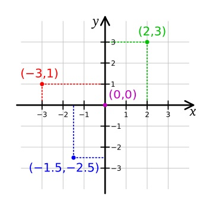
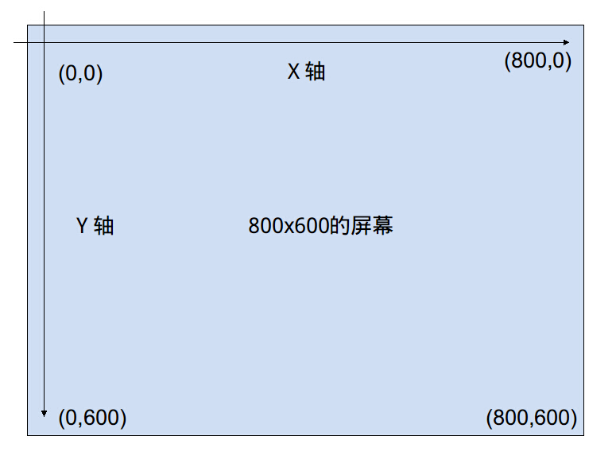
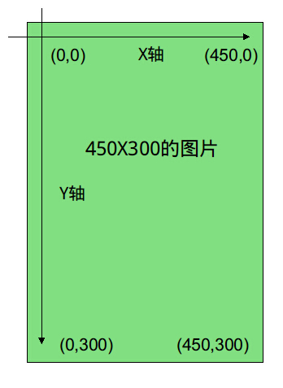
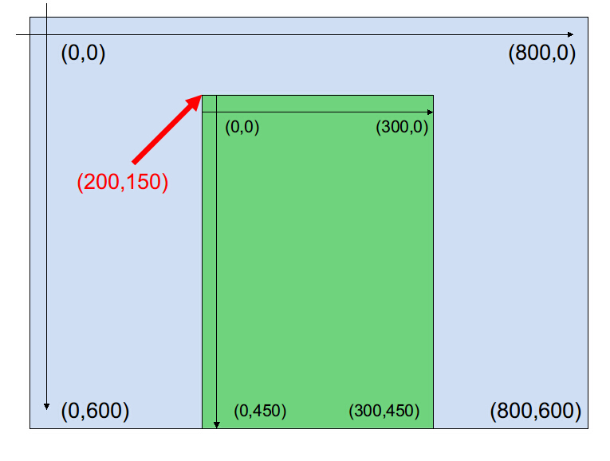
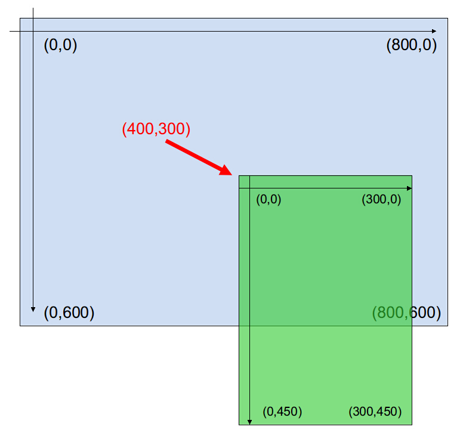
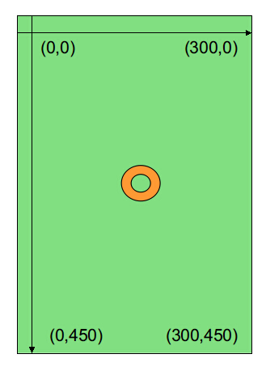
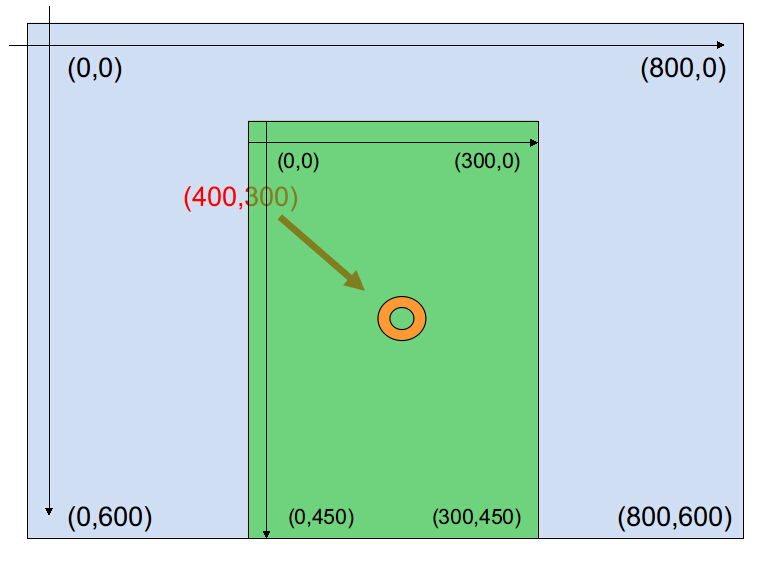

# 图像显示

* * *

在本章的教程中，我们将详细地介绍BKE的图像显示部分。  

## 精灵

精灵是所有显示图像的基础形式，无论是背景还是人物，或是界面上的按钮，这些都是精灵。精灵有着广泛的用途：

> *   使用addto命令将其添加至某个层或精灵上
> *   通过使用buttonex命令，来创建一个按钮
> *   通过使用sliderex命令，来创建一个滑条
> *   使用精灵来创建一个动画

在使用精灵之前，我们需要声明一个精灵，声明精灵的命令虽然在之前的新手教学里面已经提过了，不过我们还是重复一下：

  **sprite** _*index *file rect_  
  创建一个精灵。

  _index_  
    将要创建精灵的编号。  
  _file_  
    用于创建精灵的图片文件。  
  _rect_  
    截取的图片范围。  

在声明之后，精灵将会被载入到内存中。在需要复杂的演出效果时（屏幕上一次性显示大量的精灵），您可以预先载入一些精灵到内存中，避免在某一时刻突然载入大量的精灵，这样有可能会使游戏的帧数惨不忍睹，降低玩家的游戏体验。  
在不需要改变图像的尺寸时，图像的属性就是固定的，并且不随着游戏状态等外部因素的改变而改变，所以您可以预载图像，让其存放在图像缓存中，从而能在需要时迅速调用。

BKE支持PNG、JPG、BMP等常用图像格式，在声明精灵时，您可以不填写图像的后缀名，让BKE自行搜索符合文件名的图像文件，如果存在不同后缀名的同名文件，BKE的搜索顺序是PNG>JPG>BMP。

但仅仅只是声明的话，精灵是不会显示在屏幕上的，我们需要自己将它添加到某个精灵/层上去，这时候就需要用到 `addto` 命令了。但在将精灵添加到屏幕上之前，我们还需要先了解一下 `addto` 所作用的对象——层的含义。

## 层和addto

在BKE中，预定义了两个层（layer），它们分别是BasicLayer和MessageLayer。前者是基础层，后者则是用于显示文字消息的层，它们的默认属性如下：

    **basic_layer** _index=-1 zorder=0_  
    **message_layer** _index=-2 zorder=50_

从默认属性看来，层似乎和精灵有着很多的相同点：它们都有着编号（index）和深度值（zorder），都可以作为 `addto` 命令的目标对象……等等。事实上，在BKE的原生class中，并没有“层”这一定义，只是当我们向一个精灵上加上了别的精灵时，对于有形的图片，我们就将其称为“父精灵”；而对于无形的精灵——例如basic_layer这种看不到实体的来说，我们就将其称为“层”了。

    在以后的教学中，对于附加有精灵的有形图片，我们统称为“父精灵”，而对于无形的单位来说，则统称为“层”。

我们之前使用了 `addto` 命令将精灵添加到了BasicLayer这个层上，虽然也是老生常谈，不过我们还是来重温下 `addto` 命令的用法：

  **addto** _*index *target zorder pos opacity_  
  添加一个精灵（源精灵）到另一个层或精灵（目标精灵）上。

  _index_  
    源精灵的编号。  
  _target_  
    目标精灵/层的编号/名称  
  _zorder_  
    精灵的深度，默认为0。  
  _pos_  
    叠加的坐标，默认为[0,0]。  
  _opacity_  
    精灵的不透明度，默认为255。  

我们在新手教学里已经有过例子，之前我们将所有图片的目标层全部设置为了BasicLayer，不知道您对之前我们所提到的为什么要将目标层设置为BasicLayer是否还有印象？

> 对于初学者而言，我们建议您将所有的目标层都设置为 basic_layer ，这样的话，所有的坐标都是相对于左上角原点0,0来计算的。

这是因为 `addto` 里面的 `pos` 属性的座标全部是相对于目标左上角座标来进行计算的。而BasicLayer的左上角座标就是[0,0]，所以您可以将BasicLayer的原点座标视为屏幕的左上角座标（因为它们都是一样的）。

当我们有许多精灵要同时变形、或是相对于原点的座标计算比较麻烦时，我们可以创建一个层，将精灵添加至其上。创建layer的命令如下：

  **layer** _*index *width *height color opacity_  
  创建一个指定大小的层或颜色精灵，这里的透明度是这个精灵／层本身的透明度。

  _index_  
    创建的编号。  
  _width_  
    创建的层／颜色精灵的宽度。  
  _height_  
    创建的层／颜色精灵的高度。  
  _color_  
    层的颜色，默认为白色（即0xFFFFFF）。  
  _opacity_  
    层的不透明度，默认为0（即完全透明）。  

这个命令在指定颜色时，创建的会是一个固定大小的色块，也就是纯色的精灵，在不指定颜色或是不透明度为0时，我们就认为它所创建的是一个层。

在了解了关于层的定义之后，我们可以使用 `addto` 命令将已经声明的精灵添加到目标精灵／层上。请注意，声明和添加精灵并不一定要一起进行，您可以预先就声明好精灵，然后在合适的时间再将其添加到目标对象上。

在下面的示例中，创建了一个新的图层，并将人物立绘添加至其上显示，例子的素材可以在之前的新手教学中下载到。

    *main

    [sprite index=0 file="image/bg/BG25a_1280"]
    [addto index=0 target=basic_layer pos=[0,0] zorder=0 opacity=255]

    [layer index=10 width=1280 height=720 opacity=0]
    [addto index=10 target=basic_layer pos=[640,120] zorder=50]
    //创建了一个编号为10的层，其座标为640,120。

    [sprite index=1 file="image/character/A/1_normal"]
    [addto index=1 target=10 zorder=10 pos=[-220,0] opacity=255]
    [sprite index=2 file="image/character/B/1_normal"]
    [addto index=2 target=10 zorder=10 pos=[40,0] opacity=255]
    //将两个人物立绘添加到了层上，座标是相对于层的原点计算的
    [wait time=5000 canskip=false]
    [addto index=10 target=basic_layer pos=[440,120] zorder=50]
    //改变了层的座标，附加在层上的人物位置也随之改变了

可以看到，人物立绘的座标都是按照其目标层来计算的，在立绘图像被添加到层上之后，一旦层产生了移动，那么其上的人物立绘也会随之移动。  
我们可以使用层来做许多效果，比如说当我们需要同时移动许多精灵时，不是一个个地来进行移动操作，而是将其添加到层上之后，对层进行移动变化，这样可以使工作简单许多。

## 移除精灵

有添加精灵的场合，当然就有移除精灵的场合。在从某个界面跳转到另一个界面时，我们就必须卸载掉之前所添加的精灵，否则这些没用到的精灵就会占据我们的内存。对于某些频繁使用到的图片，我们可以使用 `addto` 命令改变其透明度，再在合适的时候重新显示，但对于不频繁使用的图片，我们建议您还是移除掉它。

移除命令有两个，一个是 `remove` ：

  **remove** _*index delete_  
  从一个精灵的父精灵/层上取下自己，该精灵变为不可见。

  _index_  
    欲移除的精灵的编号。  
  _delete_  
    是否销毁精灵，默认为false。  

另一个是 `removeall` ：

  **removeall** _*index delete_  
  从一个精灵／层上取下所有子精灵，所有子精灵变为不可见。

  _index_  
    欲移除所有子精灵的精灵／层的编号。  
  _delete_  
    是否销毁精灵，默认为false。  

可以看到，这两个移除命令，一个是针对子精灵而言，另一个则是针对父精灵／层而言。但是要注意的是，在使用 `removeall` 移除了父精灵／层上的所有精灵后，父精灵／层本身却不会消失。它们的适用场合不同，所以请不要混用。

在两个命令之中，都有一个 `delete` 参数。 `delete` 参数的意义是，如果在移除精灵但却未销毁精灵的情况下（即 `delete=false` ），精灵原有的所有可选参数都会被保留下来，下一个使用这个编号的精灵会继承之前精灵的所有可选参数；但如果销毁了精灵（即 `delete=true` ），那么精灵原有的参数全部会被销毁，新的精灵在不指定可选参数的情况下，会自动使用默认参数。

下面是一个关于 `remove` 和 `removeall` 的例子，里面同时也有关于 `delete` 参数的演示：

    *main

    [sprite index=0 file="image/bg/BG25a_1280"]
    [addto index=0 target=basic_layer pos=[0,0] zorder=0 opacity=255]
    [layer index=10 width=1280 height=720 opacity=0]
    [addto index=10 target=basic_layer pos=[640,120] zorder=50]
    [sprite index=1 file="image/character/A/1_normal"]
    [addto index=1 target=10 zorder=10 pos=[-220,0] opacity=255]
    [sprite index=2 file="image/character/B/1_normal"]
    [addto index=2 target=10 zorder=10 pos=[40,0] opacity=255]
    [wait time=5000 canskip=false]

    [remove index=1 delete=false]
    //这里移除了精灵，但是没有销毁
    [wait time=2000 canskip=false]
    [sprite index=1 file="image/character/A/2_happy"]
    [addto index=1 target=10]
    //重新添加的精灵继承了之前精灵的参数
    [wait time=2000 canskip=false]
    [remove index=1 delete=true]
    //这里移除了精灵并销毁了它
    [sprite index=1 file="image/character/A/2_happy"]
    [addto index=1 target=10]
    //重新添加的精灵使用了默认参数，即pos=[0,0] opacity=233
    [wait time=2000 canskip=false]
    [removeall index=10 delete=true]
    //请注意，这里的目标是层，移除了所有子精灵

## 图像的信息

有些时候我们需要在游戏内获取一个图像的信息，以对图像进行变换。这时我们就需要使用 `info` 与 `infoex` 命令来获取图像文件的信息。

  **info** _*file *get_  
  获取一个图片的信息，获取一个字典保存至get字符串对应的变量。字典成员有filename、width、height。

  _file_  
    待获取的图片的文件名。  
  _get_  
    信息将要保存到的变量。  

  **infoex** _*file *get_  
  获取一个精灵的信息，获取一个字典保存至get字符串对应的变量。字典成员有filename、width、height、type、pos、index、parent、children。

  _file_  
    待获取的精灵的编号。  
  _get_  
    信息将要保存到的变量。  

从命令简介不难看出，info与infoex的区别在于，前者是从文件直接获取信息，后者则是从精灵上获取信息，所以后者的返回值会比较多一些。  
在后者的返回字典中,出了文件名以及图片的宽度、高度之外，还有精灵的类型、位置、索引、父精灵、子精灵。

在获得返回的字典之后，您可以直接通过字典的键来引用相对应的值。

    [info file="character/A/1" get=picinfo]
    #var display_pos=[400-picinfo["width"]/2,120];

在例子中获取了一张图片的宽度，并将其除以二之后赋值给了另一个数组。您也可以写成下面这样：

    [info file="character/A/1" get=picinfo]
    #var display_pos=[400-picinfo.width/2,120];

两者并无任何功能上的区别，这只是字典的两种不同引用值的形式而已。

在合理使用 `info` 与 `infoex` 命令的情况下，我们可以进行一些游戏内的运算，来使图像显示出我们所预期的效果，并且减少许多事前计算。

## 锚点

想必您应该知道数学中的平面直角座标系，比如这个：

它的两条数轴，X轴与Y轴，分别置于水平位置与铅直位置；取向右与向上的方向分别为X轴和Y轴的正方向，原点O的位置即是X轴与Y轴的公共点(0,0)。

BKE中的座标系统也与之类似。唯一不同的是，在BKE座标系统中，Y轴是取向下方向为正方向的，即由上到下递增。如下图示意：

图片的座标计算也相同。假设我们有一张300x450大小的图片，那么它的座标是这样的：

在了解了二者的座标系统之后，我们可以来看看将图片放置到屏幕上的过程，比如我们现在将这张图片放到屏幕的(200,150)处：

由上图可以看到，图片的原点(0,0)自动锚定在了(200,150)这个点上。

这样我们就成功的添加了一张图片到屏幕上了，可喜可贺——不过也许您会问，如果我想将图片显示在屏幕的中心位置时应该怎么办？

或许有些人会这么回答：那就将图片放到屏幕的中心位置不就好了？

显而易见，简单地直接将图片放置在屏幕的中心点是不能让图片居中显示的，我们需要计算一下对应这个图片大小的屏幕中心点，这个很简单，相信您也已经计算出来了：

不过，每一次显示图片的时候都需要去计算图片的显示位置，未免太过于繁复了些。在没有太多显示图片的情况下还好，但如果是在有很多图片需要显示的场合，一张一张地去计算显示位置的座标就太反人类了。为了解决这个问题，我们就需要用到锚点（anchor）。

所谓的“锚点”，其实就是图片的座标系统中的某个点。当图片需要定位时，我们就可以用这个点来表达图片的显示位置。  
默认情况下，图片的锚点是左上角的原点(0,0)处。 在之前的演示中是这么表述的：“图片的原点(0,0)自动锚定在了(200,150)这个点上”——事实上，这时图片的锚点就是(0,0)这个点。当我们给图片指定一个座标时,图片的锚点就会与我们给定的座标点重合。

但归根结底，以图片的(0,0)处作为锚点只是BKE的默认情况，我们可以自己更改图片的锚点位置。

这时候我们就需要用到设置锚点的命令—— `anchor` 。

  **anchor** _*index set keep_  
  调整一个精灵/层的锚点。

  _index_  
    将要调整锚点的精灵的编号。  
  _get_  
    获取锚点的坐标。  
  _set_  
    设置锚点。  
  _keep_  
    是否保持精灵不动（将根据锚点的变化相应改变坐标，仅此一次有效），默认为false。

对于 `set` 这个参数而言，它拥有9个预设位置，它们分别是：  
"center"（中央）,"topleft"（左上）,"leftcenter"（左中），"bottomleft"（左下），"bottomcenter"（下中），"bottomright"（右下），"rightcenter"（右中），"topright"（右上），"topcenter"（上中）。

当您指定某个预设位置为锚点时，BKE会自动根据图片的大小来计算这个点相对应的图片座标中的点。但需要注意的是，当您使用 `set` 这个参数设置了锚点后，就不能再使用 `get` 参数获取锚点的坐标了，否则BKE将会报错。

这个命令的最后一个参数keep，是一个布尔值——即只能为 `true` 或 `false` 。当它的值为 `true` 时，图片的锚点会设置为新的某个点，但图片的位置将不会发生变动；当它的值为 `false` 时，图片的锚点会设置为新的某个点，并且BKE会移动图片，使它的新锚点与之前给定的座标点重合。

现在让我们将之前那张图片的锚点设定在它的中心位置：

    [anchor index=10 set="center" keep=true]

或者

    [anchor index=10 set=[150,225] keep=true]

现在图片的锚点就被设置在中心位置了：

现在我们就可以将图片直接放置在屏幕的中心位置，而不用计算那些繁复的座标了。

‘

## 深度

在BKE中，影响图片叠加层次的是深度值（zorder）。

对于处于同一层级的精灵来说， `zorder` 的值越大，精灵的显示位置就越靠前；对于不同层级的精灵来说，如果A精灵所在层级的 `zorder` 要低于B精灵所在的层级，那么无论怎样增加A精灵的 `zorder` 值，A精灵都不可能显示在B精灵之前；对于同层级同 `zorder` 的精灵来说，后添加者在上。

某个精灵的 `zorder` 值可以通过两个方式来更改，第一种是在添加精灵时设置它的 `zorder` 值，第二种则是使用 `zorder` 命令来修改：

  **zorder** _*index set get_  
  调整/获取一个精灵的 zorder 值。

  _index_  
    将要调整 zorder 值的精灵的编号。  
  _set_  
    设置的 zorder 值。  
  _get_  
    获取的 zorder 值将要保存到的变量。  

通过 `zorder` 命令，我们不仅可以设置某个精灵的 `zorder` 值，还可以获取某些精灵的 `zorder` 值，以便于在BKE内部实时计算空闲 `zorder` 值来添加精灵，或是进行其他的计算。

## Go for the next

到此，BKE的图像部分介绍就算告一个段落了。

不过还是那句话：这还只是冰山的一部分。剩下的冰山会随着之后我们的不断深度而露出它的全貌的，等不及的同学可以自己先学习一下:D

感谢阅读本章教程，我们下一章见~