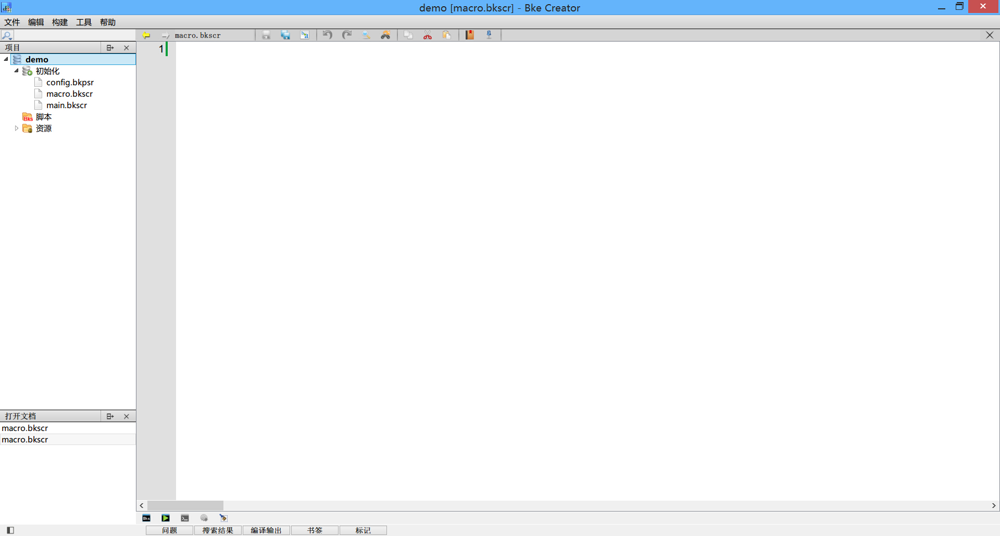
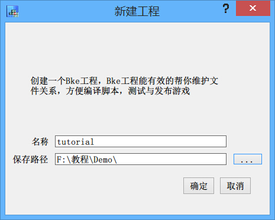
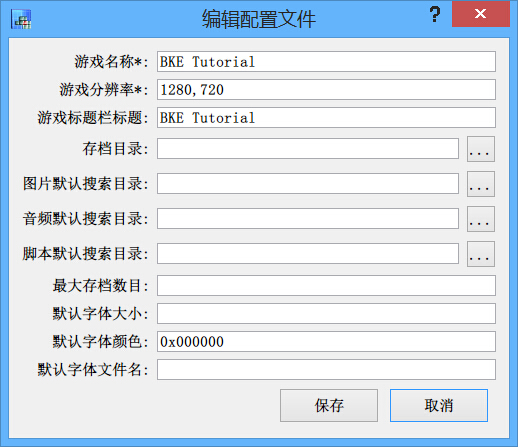
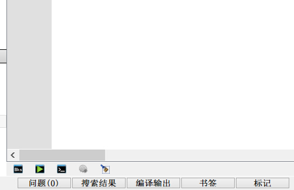
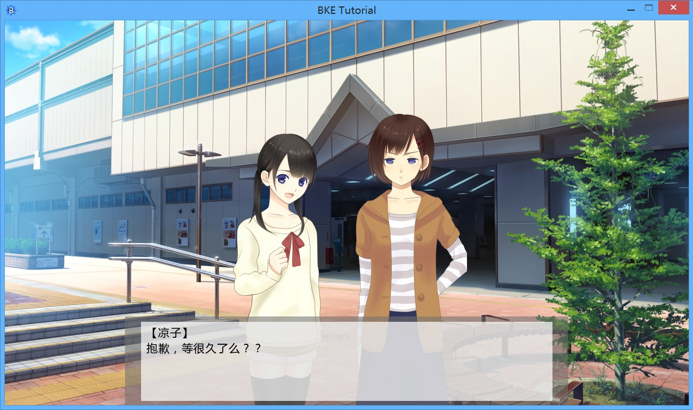
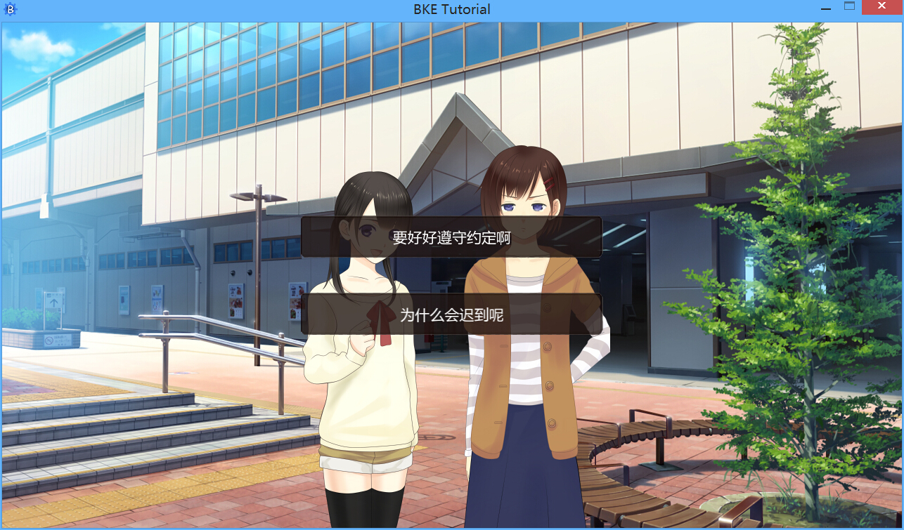

# 欢迎来到BKE的世界！

* * *

这里是BKEngine的文档中心，在这里，我们会持续地更新BKE的相关教学文档。您可以访问我们的主页获取更多有关BKE的信息：

[http://bke.bakery.moe](http://bke.bakery.moe)

或者是在我们的论坛/交流群与其他的用户进行交流：

[http://bbs.bakery.moe](http://bbs.bakery.moe)

交流群地址：

# 新手教学

* * *

欢迎观看BKEngine（以下简称为BKE）的新手教学。本教学的目的是让您在几步简单的学习步骤后，制作出一个简单的BKE游戏，从而对本引擎有一个基础的了解。

## BKE Creator

在进行新手教学之前，请确认您已经从NPC的村长那里领到了您的新手装备！[点击这里](http://bke.bakery.moe/download.html)下载BKE Creator，并将其解压到您硬盘的某处。

    警告：如果您直接从压缩包中运行它，BKE Creator可能将不会正常工作。

现在我们已经拿到了我们的新手装备，在开始制作新游戏之前，我们应该花点时间来熟悉熟悉它。

BKE Creator能让您创建、管理、编辑或是运行你的BKE游戏。

点击 `BKE Creator.exe`，来启动BKE Creator。

    提示：在Windows系统下，第一次启动BKE Creator速度可能较慢。

如果一切正常的话，您会看到这样的界面：

这就是BKE的默认编辑器BKE Creator。让我们来新建一个BKE工程试试看。

点击“文件”菜单，选择里面的“新建项目”，编辑器会提醒您输入项目名称，以及选择项目保存的路径，在新手教学中，我们给这个项目起名为tutorial（当然，你也可以自己起一个喜欢的名字）。

大功告成！这样，我们就建立了自己的第一个BKE游戏。

不过说是“游戏”，其实现在的它并没有包含一个游戏所需的任何要素——文本、图像、音乐。接下来我们的任务，就是学习怎样让引擎显示文字。

但少安毋躁，在学习让引擎显示文字之前，我们还需要先了解一些基本知识。

点击左侧的项目名，您可以看到项目下的“初始化”子项，里面有以下三个文件—— `main.bkscr` 、 `config.bkpsr` 和 `macro.bkscr` 。

    提示：“.bkscr”后缀，就是BKE的脚本文件格式。

双击 `config.bkpsr` ，对游戏的标题、分辨率等一系列参数进行设置。为了配合后面的教程，在这里我们将游戏的分辨率设置为1280×720。游戏名称和标题您可以依照自己的喜好来输入，在本教程中我们输入的是 “BKE Tutoial” 。

在设置完成后，我们来了解下BKE的基本脚本组成：

  `main.bkscr`：每个BKE项目都必须拥有这个脚本。它是游戏主程序的入口，解释器会从这个脚本开始运行。  
  `macro.bkscr`：负责管理自定义函数的脚本，仅可以在本脚本内导入（import）其它的脚本。（关于import的知识会在后面会有详细介绍，现在只做一个基础的了解即可。）

除这两者之外的其它脚本都是用户自己编写的脚本，包括自定义函数的脚本、剧本、变量设置等。在BKE Creator中，当您编写好自己的游戏脚本后，可以点击编辑器底部的编译按钮对脚本进行错误检测，并使用运行按钮运行您自己的游戏。

底部五个图片按钮从左至右分别是：编译、编译并运行、运行、调试和清理编译项目。

在了解了这些前置知识之后，现在我们可以正式开始游戏的制作了。

## 一个文字组成的游戏

开始制作之前，请点击[这里](resources/Material.zip)下载制作这个演示游戏所需的素材。

    *main
    【凉子】[r]
    抱歉，等很久了么？？[p]
    【真由】[r]
    啊，真是的，凉子你怎么那么慢？[p]

上面就是一个最简单的BKE游戏的示例，虽然它既没有图像也没有音乐，但是它确实是一个完整的小故事。

第一行是一个以`*`开头的英文单词。在BKE中，以`*`开头的行我们称之为“标签”。标签的作用是使用一个名称来标记脚本中的一个位置，以便解释器跳转。上面的例子中，我们在 `main.bascr` 文件中创建了一个名叫“main”的标签。在BKE中， `main` 标签是一个特殊的存在。BKE主程序的默认入口是 `main.bascr` 文件中的 `main` 标签，所以一个新的BKE游戏必须要拥有一个 `main` 标签。如果您没有创建 `main` 标签的话，编译器将会报警。

在例子中，我们可以看到在屏幕上显示的文字，以及一些被半角中括号框起来的文字。在BKE中，所有被半角中括号框起来的文字以及“@”符号之后的文字都会被解释器识别为命令，除此之外的所有东西（“#”符号例外，我们将会在后面解释）都会被视作文字打印在屏幕上。不过需要注意的是，以“@”符号声明的命令必须单独存在，前后都不能有除命令之外的东西存在,比如例子中的 `[p]` 就不能替换为 `@p` 。

上面例子中的“r”、“p”命令的功能分别是：  
  r  手动换行  
  p  换页等待，点击后换页  

另外还有“l”命令，它的功能是：  
  l  等待点击

您可以使用中括号框起来的写法，也可以使用以“@”开头的写法，或是两者兼而有之，这完全取决于您的喜好。

## 图像

让我们来为我们的游戏加上点图像。

    *main

    [sprite index=0 file="image/bg/bg441a_1280"]
    [addto index=0 target=basic_layer pos=[0,0] zorder=0 opacity=255]

    【凉子】[r]
    抱歉，等很久了么？？[p]
    【真由】[r]
    啊，真是的，凉子你怎么那么慢？[p]

将上面的代码更新到您的 `main.bkscr` 文件中，保存并编译，您就可以看见新的效果了——游戏拥有了背景画面。（但是同时，我们的文字也看不清了。不过别担心，我们会在后面解决这个问题）

在原有的对话之上，可以看到多出了新的两行命令。这两行命令就是用于添加图像的命令。在游戏里，无论是背景还是立绘，或是漫天飞舞的樱花花瓣，它们的本质都是图像；在BKE中，我们将这些图像统称为 `精灵` （sprite）。在将精灵添加到屏幕上之前，我们需要先声明它们，Sprite在BKE中同时也是用于声明精灵的命令，它的格式如下：

  **sprite** _*index *file rect_  
    创建一个精灵。

    _index_  
      将要创建精灵的编号。  
    _file_  
      用于创建精灵的图片文件。  
    _rect_  
      截取的图片范围。

（带*的项为必须存在的参数名，其余的参数为可选参数，下同）

在上面的第二行，我们就使用了 `sprite` 命令声明了一张图像。它的编号（index）是0号，图像文件是image/bg/文件夹下的bg441a_1280——等等，后缀名哪去了？  
BKE有很多人性化的地方，这就是其中之一。您可以不填写图像的后缀名，交由BKE来自动搜索，一旦BKE搜索到了符合名称的文件，就会自动使用这个文件。如果您在之前的 `config.bkpsr` 中指定了搜索图像文件的文件夹，那么您甚至可以不写图像的所在文件夹。

    提示：如果存在不同后缀名的同名文件，BKE的搜索顺序是PNG>JPG>BMP。

在声明了精灵后，接下来的步骤就是将它添加到屏幕上。第三行的 `addto` 命令作用就是将精灵添加到指定的位置。下面是这个命令的格式：

  **addto** _*index *target zorder pos opacity_  
    添加一个精灵（源精灵）到另一个层或精灵（目标精灵）上。

    _index_  
      源精灵的编号。  
    _file_  
      目标精灵/层的编号/名称。  
    _zorder_  
      精灵的深度，默认为0。  
    _pos_  
      叠加的坐标，默认为[0,0]。  
    _opacity_  
      精灵的不透明度，默认为255。  

在第二行用 `sprite` 声明了一个精灵后，第三行我们使用 `addto` 命令将其添加到了 **`basic_layer`** 这个层上。层级可以是用户自己定义的，也可以是BKE中默认定义的层。在BKE中，预先定义的层有两个，它们分别是 **`basic_layer`** 和 **`message_layer`** 。前者是基础层，后者是用于显示文字消息的层。它们的默认属性如下：

    **basic_layer** _index_=-1 _zorder_=0  
    **message_layer** _index_=-2 _zorder_=50  

例子里面，我们将图片的 `zorder` 设置为了0。  
在BKE中，对于处于同一层级的精灵来说， `zorder` 的值越大，精灵的显示位置就越靠前；对于不同层级的精灵来说，如果A精灵所在层级的 `zorder`要低于B精灵所在的层级，那么无论怎样增加A精灵的 `zorder` 值，A精灵都不可能显示在B精灵之前；对于同层级同 `zorder` 的精灵来说，后添加者在上。  
在看完剩余的命令参数解释后，您可以自行添加一些图片到屏幕上，以更好的理解精灵的层级关系。

因为添加的图片是背景文件，所以我们将它的显示座标设置为0,0， 以便于让图片正确的覆盖整个背景。但严格的来说，这个0,0其实并不是指屏幕的左上角，而是指的是相对于 **`basic_layer`** 的偏移量。对于初学者而言，我们建议您将所有的目标层都设置为 **`basic_layer`** ，这样的话，所有的坐标都是相对于左上角原点0,0来计算的（即和通常的坐标轴没有任何区别）。

最后一个参数是精灵的不透明度，值的范围从0到255，值越大越不透明。例子中的精灵是完全不透明的。

在了解了声明精灵和添加精灵之后，我们就可以如法炮制，再添加几个其它的精灵了。现在让我们添加上角色的立绘图像。

    *main

    [sprite index=0 file="image/bg/bg441a_1280"]
    [addto index=0 target=basic_layer pos=[0,0] zorder=0 opacity=255]

    [sprite index=1 file="image/character/A/2_happy"]
    [addto index=1 target=basic_layer zorder=10 pos=[400,120] opacity=255]
    [sprite index=2 file="image/character/B/7_wordless"]
    [addto index=2 target=basic_layer zorder=10 pos=[640,120] opacity=255]

    【凉子】[r]
    抱歉，等很久了么？？[p]
    【真由】[r]
    啊，真是的，凉子你怎么那么慢？[p]

完成了！现在它看起来更像一个游戏了——除了我们的文字显示，它还有一点小小的问题，我们会在接下来的小节里修复这个问题。

## 文字

BKE自带了一个基础的对话框，但是默认并没有使用。现在我们需要做的就是启用这个基础的对话框，让对话文字正确显示在其中。

点击BKE Creator左侧视图中的 `macro.bkscr` ，编辑其中的内容：

    *register
    [import file="extend.bkscr"]
    [return]

在 `macro.bkscr` 中，首行必须是名为 `register` 的标签，下面声明了要引用和定义的宏（Macro）文件。

    宏的定义：宏（Macro），是一种批量批量处理的称谓。它将小命令或动作转化为一系列指令。

在这里，我们引用了一个名为`extend.bkscr`的文件。成功声明引用后，我们就可以使用这个宏文件内预定义的命令了。

请[点击这里](resources/extend.bkscr)下载使用到的宏文件。

在左侧视图的“脚本”处点击右键，选择“添加文件”，然后在随后弹出的窗口内选择刚才下载的`extend.bkscr`。

修改 `main.bkscr` 文件，在第二行处加上 `extend.bkscr` 内定义好的设置对话框命令。

    *main
    [basic_dialogbox]//使用预定义的命令
    //在BKE中，以//开头的行都会被视为注释
    [sprite index=0 file="image/bg/bg441a_1280"]
    [addto index=0 target=basic_layer pos=[0,0] zorder=0 opacity=255]

    [sprite index=1 file="image/character/A/2_happy"]
    [addto index=1 target=basic_layer zorder=10 pos=[400,120] opacity=255]
    [sprite index=2 file="image/character/B/7_wordless"]
    [addto index=2 target=basic_layer zorder=10 pos=[640,120] opacity=255]

    【凉子】[r]
    抱歉，等很久了么？？[p]
    【真由】[r]
    啊，真是的，凉子你怎么那么慢？[p]

保存并编译运行，现在文字已经正确的显示在了对话框中了。

## 声音、音乐和音效

许多视觉小说都需要音乐来渲染气氛。在BKE中，音乐有三种：背景音乐、音效、语音。分为三种并不是说它们本质上有什么区别，而是BKE处理它们的方式不同。让我们来看看BKE对于这三种不同音乐的处理方式：

  **bgm** _*file loop vol fadein loopto_  
    播放背景音乐。

    _file_  
      将要载入并播放的音频文件。  
    _loop_  
      是否循环，默认为`false`。  
    _vol_  
      音量，默认为100。  
    _fadein_  
      淡入的时间，默认为0。  
    _loopto_  
      设立循环起始点，单位毫秒，默认为0。  

  **se** _*file channel vol fadein loop_  
    播放音效。

    _file_  
      将要载入并播放的音频文件。  
    _channel_  
      指定声音播放的通道编号，默认为0。  
    _vol_  
      音量，默认为100。  
    _fadein_  
      淡入的时间，默认为0。  
    _loop_  
      是否循环，默认为`false`。  

  **voice** _*file vol_  
    播放语音。

    _file_  
      将要载入并播放的音频文件。  
    _vol_  
      音量，默认为100。  

对于背景音乐，BKE可以设置它的循环起始点，这意味着你可以直接截取音频文件的某一段作为背景音乐播放，而不用对其进行任何的处理。对于音效文件，BKE则需要用户自行指定其播放的通道，而背景音乐和语音都有自己默认的声音通道，它们分别是是 `bgm` 和 `voice` 。

音乐可以通过stop命令来停止播放。

  **stop** _channel fadeout_  
    播放语音。

    _channel_  
      将要停止的通道，若此参数不存在将停止所有通道。  
    _fadeout_  
      淡出的时间，默认为0。  

来给我们的游戏加上音乐吧。

    *main
    [bgm file="sound/bgm/tam-n01" loop=true]

    [basic_dialogbox]
    [sprite index=0 file="image/bg/bg441a_1280"]
    [addto index=0 target=basic_layer pos=[0,0] zorder=0 opacity=255]

    [sprite index=1 file="image/character/A/2_happy"]
    [addto index=1 target=basic_layer zorder=10 pos=[400,120] opacity=255]
    [sprite index=2 file="image/character/B/7_wordless"]
    [addto index=2 target=basic_layer zorder=10 pos=[640,120] opacity=255]

    【凉子】[r]
    抱歉，等很久了么？？[p]
    【真由】[r]
    啊，真是的，凉子你怎么那么慢？[p]

    [stop channel=bgm] 

保存并编译运行，你可以听到现在游戏拥有背景音乐啦。

    BKE支持的音频格式有.mp3、.ogg与.wav。

## 选项

在引用了 `extend.bkscr` 文件后，您可以使用 `select` 命令制作出一个选项。

`select` 命令的格式如下：

  **select** _file text label se_  
    创建一个选择菜单。

    _file_  
      用于选择项的背景图。  
    _text_  
      用于显示的选择项文本，以数组形式传入。  
    _label_  
      对应文字跳转的标签，以数组形式传入。  
    _se_  
      选项按下时的音效，没有则不播放。  

让我们来制作一个选择肢：

    *main
    [bgm file="sound/bgm/tam-n01" loop=true]

    [basic_dialogbox]
    [sprite index=0 file="image/bg/bg441a_1280"]
    [addto index=0 target=basic_layer pos=[0,0] zorder=0 opacity=255]

    [sprite index=1 file="image/character/A/2_happy"]
    [addto index=1 target=basic_layer zorder=10 pos=[400,120] opacity=255]
    [sprite index=2 file="image/character/B/7_wordless"]
    [addto index=2 target=basic_layer zorder=10 pos=[640,120] opacity=255]

    【凉子】[r]
    抱歉，等很久了么？？[p]
    【真由】[r]
    啊,真是的，凉子你怎么那么慢？[p]

    [select file="image/menu/textwindow/2" text=["要好好遵守约定啊","为什么会迟到呢"] label=["*A","*B"]]

    *A
    【真由】[r]
    下一次可要好好遵守约定啊。[p]
    [quit]

    *B
    【真由】[r]
    平日里你不是很守时的吗？今天怎么迟到了？[p]
    [quit]

保存并编译运行，您就可以看到，在之前的两句对话结束后，就产生了一个选项，不同的选择会让玩家跳转至不同的标签处。

## 跳转和if命令

我们可以在上面的选项中加入一些判断，好让不同的选择通向不同的结局。这时候就需要掌握如何声明变量和根据变量的值来进行不同的操作。

在BKE中，声明变量必须以“#var”开头，后面书写变量的名称，行的最后以“;”号结束。（事实上，在BKE中，任何以“#”开头的行都必须以“;”号结束，详细原因会在以后的教程中介绍）

我们来定义一个变量，用它来记录人物的选择。

    *A
    【真由】[r]
    下一次可要好好遵守约定啊。[p]
    #var ask=-1;
    [jump label="*continue"]

    *B
    【真由】[r]
    平日里你不是很守时的吗？今天怎么迟到了？[p]
    #var ask=1;
    [jump label="*continue"]

在不同的选择下，“ask”这个变量也会有不同的值。怎样用变量的值来控制剧情的走向呢？这时我们就需要用到 `if` 命令。

`if` 命令的格式如下：

  **if** _*exp_  
    根据表达式判断执行下面的语句，或跳转至else或elseif后面执行。

    _exp_  
      条件表达式。  

`elseif` 与 `if` 命令的格式相同：

  **elseif** _*exp_  
    根据表达式判断执行下面的语句，或跳转至下一个else或elseif后面执行。

    _exp_  
      条件表达式。  

当您使用了 `if` 命令进行条件判断时，您必须使用 `endif` 命令。它用于标志着 `if` 命令块的结束。

这里是一个完整的 `if` 命令块的例子：

    @if "ask>0"
    @jump label="*ask"
    @else
    @jump label="*no_ask"
    @endif

它的意思是，在“ask”这个值大于0的情况下时，跳转到“ask”这个标签处，在其余情况下，则跳转到“no_ask”这个标签处。这里用到了控制跳转命令 `jump` 。

  **jump** _*label file_  
    跳转到指定的标签处。

    _label_  
      将要跳转的标签。  
    _file_  
      标签所在的文件。  

把上面的代码整合进我们的游戏中，我们就可以按照玩家不同的选择来控制游戏的流程了。

    *main
    [bgm file="sound/bgm/tam-n01" loop=true]

    [basic_dialogbox]
    [sprite index=0 file="image/bg/bg441a_1280"]
    [addto index=0 target=basic_layer pos=[0,0] zorder=0 opacity=255]

    [sprite index=1 file="image/character/A/2_happy"]
    [addto index=1 target=basic_layer zorder=10 pos=[400,120] opacity=255]
    [sprite index=2 file="image/character/B/7_wordless"]
    [addto index=2 target=basic_layer zorder=10 pos=[640,120] opacity=255]

    【凉子】[r]
    抱歉，等很久了么？？[p]
    【真由】[r]
    啊,真是的，凉子你怎么那么慢？[p]

    [select file="image/menu/textwindow/2" text=["要好好遵守约定啊","为什么会迟到呢"] label=["*A","*B"]]

    *A
    【真由】[r]
    下一次可要好好遵守约定啊。[p]
    #var ask=-1;
    [jump label="*continue"]

    *B
    【真由】[r]
    平日里你不是很守时的吗？今天怎么迟到了？[p]
    #var ask=1;
    [jump label="*continue"]

    *continue
    @if "ask>0"
    @jump label="*ask"
    @else
    @jump label="*no_ask"
    @endif

这个游戏还不完整，因为它还缺少必要的“ask”与“no_ask”这两个标签，以及这两个标签下对应的内容。但是在经历了上面的学习之后，相信您已经可以自己独立完成这个游戏的后半部分了。

利用手里面的素材,续写一下后面的故事吧！ :)

（如果您不想自己续写的话，请在后面下载完整版示例游戏查看效果）

## 发布游戏

恭喜您已经掌握了如何用BKE来制作属于自己的游戏！

在您完成了您自己的游戏后，您可以将它打包上传，并进行分享。

我们鼓励您使用BKE进行原创创作，凭借其强大的跨平台功能，您可以在任何平台上体验您自己的游戏，您会看见它们在不同的平台上都拥有完全相同的演出效果。

**我们非常乐意为您的原创游戏进行宣传，如果您使用BKE完成了自己的原创游戏，您可以[致信我们](mailto:bakerist.info@gmail.com)，我们会将您的游戏放到我们的引擎展示页面，为您游戏的推广出一份力。**

## 示例游戏的完整脚本

您可以在[这里](resources/BKE_tutorial_script.zip)下载到示例游戏的完整脚本。  
在运行它之前，请确认您已经下载了示例游戏的资源包，并将它们放在了同一目录下。

或者直接下载[完整版的示例游戏](resources/BKE_tutorial.zip)，将BKE引擎放置在游戏根目录内启动。

## Go for the next！

好了，新手教程就到此为止。现在应该干什么？

您可以：

*   利用已经学到的知识，开始制作您自己的原创游戏。

*   访问我们的[网站](http://bke.bakery.moe)来获取新的教程以及引擎的更新。

*   查看现有的API列表（放置于Creator目录下的API_list文件），尝试制作更复杂的游戏。

*   加入我们的交流群，与其他人分享交流您的心得。

考虑到难度原因，在这篇新手教程里我们省略掉了许多复杂的东西，我们会在之后的教程中详细介绍它们的功能及用法。为了更详细的了解 BKE ，我们建议您继续阅读接下来的教程，让我们来向您展示这些功能。

如果您对BKE有不了解的地方，您可以在我们的[官方论坛](http://bbs.bakery.moe/)发帖询问，我们会热情的对待每一个初学者。

感谢您选择了 BKEngine。我们期待着您的大作！
