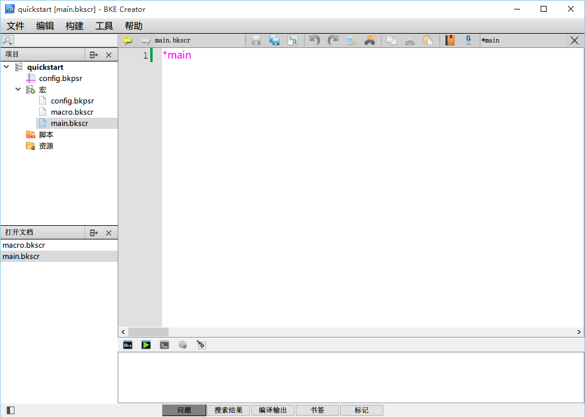
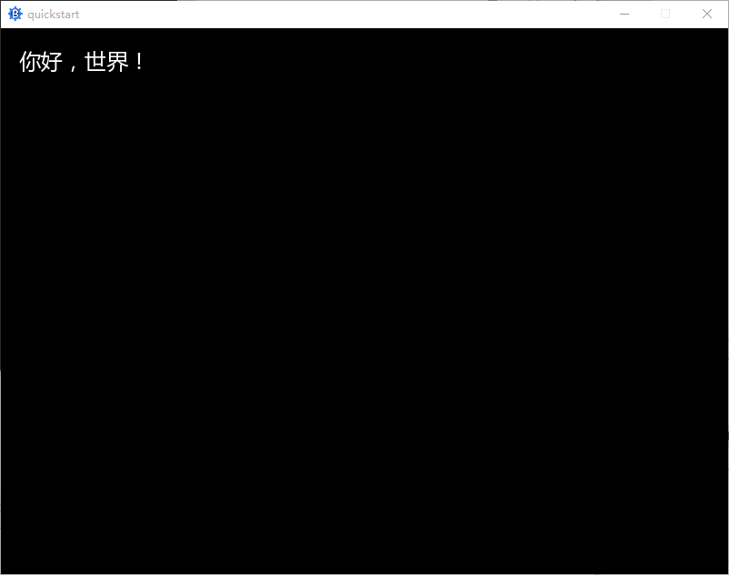
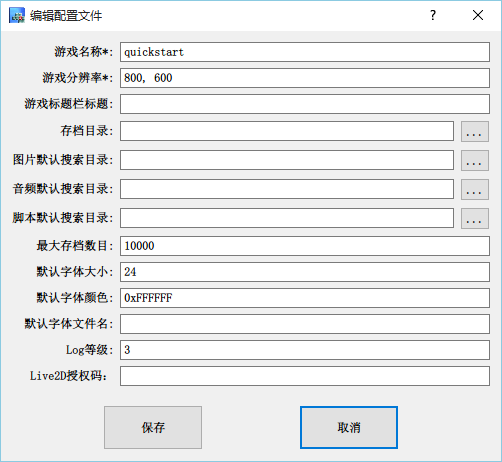
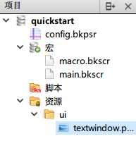
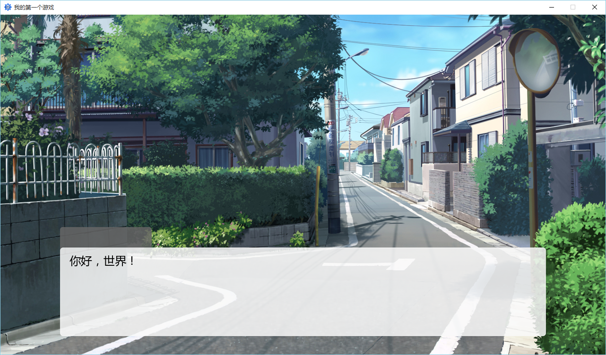
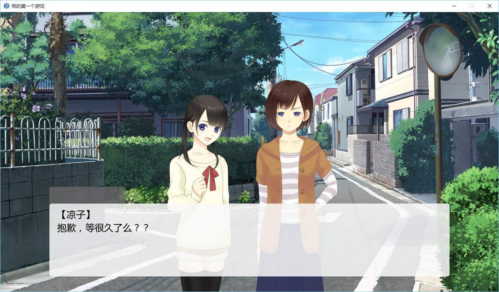

#快速入门

[TOC]

##初识BKEngine
BKEngine是面包工坊开发的跨平台AVG游戏引擎，同时支持三大桌面平台（Win、Linux、OSX）和两大移动平台（iOS、Android）。本教程将带你快速了解如何使用 BKEngine 进行游戏制作。

##开发工具
在本教程中，介绍使用面包工坊官方的 BKECreator 开发工具进行游戏制作。



这就是BKE Creator的基本界面。左侧选择文件，右侧编辑内容，是不是很容易理解？

##你好，世界！
启动BKE Creator，从左侧双击打开main.bkscr文件，你会看到如上图显示的内容，只有一行文字。
我们称`*main`为一个**标签**，现在你只需要记住这个名字就可以了，以后的内容中将详细讲解。
下面，尝试将其改为：
```ruby
*main
你好，世界！[p]
@quit
```
你可以点击右侧中部的绿色三角，启动调试功能，点击试试看！



这就是AVG游戏引擎的基本功能——打印文字。

##修改标题和分辨率
现在，Creator 默认的游戏分辨率是800\*600，而下载的素材是为1280\*720分辨率制作的。800\*600是较为传统的AVG游戏分辨率，现在大家的电脑、手机分辨率越来越高，且多为宽屏，所有我们更推荐使用1280\*720分辨率制作你的游戏。

双击Creator左侧的`config.bkpsr`，出现游戏设置对话框。



在这里，你可以设置游戏名称、分辨率等重要参数。请将游戏名称改为`我的第一个游戏`，分辨率改为`1280, 720`，并点击保存。
由于修改了分辨率，我们需要清空旧有存档，请从文件夹中找到工程所在的目录，删除其下的`SaveData`文件夹。
再次点击绿色三角调试运行，你会发现窗口变大了，并且标题改成了「我的第一个游戏」。

##创建文字框
我们已经介绍了如何在游戏窗口中打印一行文字，但光是这样还不够，我们需要让文字显示在我们需要的位置，并且加上文字框图片，调整字号等。**[点击此处下载所需的素材文件](../examples/textwindow.png)**

在Creator左侧的`资源`上右击，选择`添加目录`，在弹出的对话框中（工程目录下）创建`ui`文件夹，并将之前下载的`textwindow.png`放入该文件夹。再次右键选择`添加文件`，选择刚才放入的文件，点击确定。如图所示



双击打开`main.bkscr`，将下面内容复制，并覆盖原有内容：
```ruby
*main
[textwindow file="ui/textwindow.png" pos=[126,450] rect=[20,55,1008,231]]
你好，世界！[p]
@quit
```
调试运行，可以看到文字已经在文字框中显示。这时白色的字体就不太合适了，可以通过之前的「游戏设置对话框」将文字改为黑色，黑色的颜色值为`0x000000`。
最终效果：


你可以调整`textwindow`指令的`pos`或`rect`参数的数字大小，看看会发生什么？
P.S. 在`textwindow`或每个参数的末尾按分号键，可以弹出代码提示，按回车确认。试试更多功能吧！

##修改文字样式
本节介绍如何修改文字框内文字的字号和颜色等，使用`textstyle`指令。
将脚本改为：
```ruby
*main
[textwindow file="ui/textwindow.png" pos=[126,450] rect=[20,55,1008,231]]
你好，世界！[p]
[textstyle size=16 color=0xff0000]
你好，世界！现在，字号和颜色一定发生了改变。[p]
@quit
```
运行一下，你将看到效果。
`textstyle`命令还能为文字增加粗体、斜体、删除线等等功能，请自行研究，我们会在后续的文档中详细说明。

##显示背景
说了这么半天，怎么能没有背景图片呢！下面将介绍如何用 BKEngine 显示背景图片。
在工程目录下创建`images`文件夹，并按照之前的步骤，添加到资源中，**[点击此处下载所需的素材文件](../examples/BG32a_1280.jpg)**，并放入`images`文件夹内，在Creator的资源处右键添加。

之后，将下面内容全部复制进`main.bkscr`：
```ruby
*main
[sprite index=10 file="images/BG32a_1280"]
[addto index=10 target=basic_layer zorder=0 pos=[0,0] opacity=255 ]

[textwindow file="ui/textwindow.png" pos=[126,450] rect=[20,55,1008,231]]
你好，世界！[p]
[textstyle size=16 color=0xff0000]
你好，世界！现在，字号和颜色一定发生了改变。[p]
@quit
```
运行，可以看到游戏有了背景图片！



我们再回过头来看看我们刚才到底做了什么。
在原有的对话之上，可以看到多出了新的两行命令。这两行命令就是用于添加图像的命令。在游戏里，无论是背景还是立绘，或是漫天飞舞的樱花花瓣，它们的本质都是图像；在BKE中，我们将这些图像统称为`精灵 （sprite）`。

在上面的第二行，我们就使用了`sprite`命令声明了一张图像。它的编号（index）是10号，图像文件是`images`文件夹下的`BG32a_1280`——等等，后缀名哪去了？
BKEngine 有很多人性化的地方，这就是其中之一。您可以不填写图像的后缀名，交由引擎来自动搜索，一旦BKEngine搜索到了符合名称的文件，就会自动使用这个文件。如果您在之前的`config.bkpsr`中指定了搜索图像文件的文件夹，那么您*甚至可以不写图像的所在文件夹*。

在声明了精灵后，接下来的步骤就是将它添加到屏幕上。第三行的`addto`命令作用就是将精灵添加到指定的位置。
在第二行用`sprite`声明了一个精灵后，第三行我们使用`addto`命令将其添加到了`basic_layer`这个层上。层级可以是用户自己定义的，也可以是BKE中默认定义的层。在BKE中，预先定义的层有两个，它们分别是`basic_layer`和`message_layer`。前者是基础层，后者是用于显示文字消息的层。它们的默认属性如下：
```ruby
basic_layer index=-1 zorder=0
message_layer index=-2 zorder=50
```
例子里面，我们将图片的 zorder 设置为了0。

在BKE中，对于处于同一层级的精灵来说， zorder 的值越大，精灵的显示位置就越靠近眼睛；对于不同层级的精灵来说，如果A精灵所在层级的 zorder要低于B精灵所在的层级，那么无论怎样增加A精灵的 zorder 值，A精灵都不可能显示在B精灵之前；对于同层级同 zorder 的精灵来说，后添加（addto）者在上。
在看完剩余的命令参数解释后，您可以自行添加一些图片到屏幕上，以更好的理解精灵的层级关系。

因为添加的图片是背景文件，所以我们将它的显示座标设置为`[0, 0]`， 以便于让图片正确的覆盖整个背景。但严格的来说，这个`[0, 0]`其实并不是指屏幕的左上角，而是指的是相对于`basic_layer`的偏移量。对于初学者而言，我们建议您将所有的目标层都设置为`basic_layer`，这样的话，所有的坐标都是相对于左上角原点`[0, 0]`来计算的（即和通常的坐标轴没有任何区别）。

最后一个参数是精灵的不透明度，值的范围从0到255，值越大越不透明。例子中的精灵是完全不透明的。

##显示人物立绘
在了解了声明精灵和添加精灵之后，我们就可以如法炮制，再添加几个其它的精灵了。现在让我们添加上角色的立绘图像。
下载人物立绘：[立绘A](../examples/A_happy.png) [立绘B](../examples/B_wordless.png)  并保存到`images`文件夹中。

复制以下内容，替换`main.bkscr`：
```ruby
*main
[sprite index=10 file="images/BG32a_1280.jpg"]
[addto index=10 target=basic_layer zorder=0 pos=[0,0] opacity=255]
[textwindow file="ui/textwindow.png" pos=[126,450] rect=[20,55,1008,231]]

[sprite index=11 file="images/A_happy"]
[addto index=11 target=basic_layer zorder=10 pos=[400,120] opacity=255]
[sprite index=12 file="images/B_wordless"]
[addto index=12 target=basic_layer zorder=10 pos=[640,120] opacity=255]

【凉子】[r]
抱歉，等很久了么？？[p]
【真由】[r]
啊，真是的，凉子你怎么那么慢？[p]

@quit
```
运行一下试试看！



现在它看起来更像一个游戏了——除了我们的文字显示，它还有一点小小的问题，我们会在接下来的小节里修复这个问题。

##将文字作为精灵显示
有的时候，我们需要在文字框以外的地方使用文字，这就要用到**文字精灵（TextSprite）**。
下面，我们将演示如何使用文字精灵将人物的姓名显示在文字框上。

复制并替换`main.bkscr`的内容：
```ruby
*main
[sprite index=10 file="images/BG32a_1280.jpg"]
[addto index=10 target=basic_layer zorder=0 pos=[0,0] opacity=255]
[textwindow file="ui/textwindow.png" pos=[126,450] rect=[20,55,1008,231]]

[sprite index=11 file="images/A_happy"]
[addto index=11 target=basic_layer zorder=10 pos=[400,120] opacity=255]
[sprite index=12 file="images/B_wordless"]
[addto index=12 target=basic_layer zorder=10 pos=[640,120] opacity=255]

[textsprite index=21 text="凉子" size=24 color=0xffffff xinterval=3]
[anchor index=21 set="center"]
[addto index=21 target=message_layer pos=[97,20]]
抱歉，等很久了么？？[p]

[textsprite index=21 text="真由" size=24 color=0xffffff xinterval=3]
[anchor index=21 set="center"]
[addto index=21 target=message_layer pos=[97,20]]
啊，真是的，凉子你怎么那么慢？[p]

美好的一天开始了[p]

@quit
```

`textsprite`指令是BKEngine的常用指令之一，作用是创建一个文字精灵，该精灵的用法与一般的精灵并无太大差别，仅在于内容的不同——一个是文字，一个是图像。任何精灵要想显示在屏幕上，都需要`addto`指令才能实现。
`index`略去不讲，与`sprite`指令相同；
`text`参数指定要显示的文字内容，`size`指定字号，`color`则是文字颜色。`xinterval`指令是说文字之间的横向间距（字间距），与此对应的还有`yinterval`，即行间距。

`anchor`指令是确定精灵的「锚点」，锚点是精灵上的一个特定的坐标点，在执行`addto`指令时，锚点所处的位置就是`pos`参数指定的坐标。通过调整锚点，可以实现精灵相对于所在层的左、右对齐和居中等效果。`set`参数可接受坐标数组（如[0, 0]）也可接受数个内置的位置字符串，如“center”是将锚点设置在了精灵的正中心。
有关`anchor`的更多信息请查阅后续文档。


运行一下，会发现姓名可以显示在黑色的姓名框区域了，但仍然有点小问题，即在显示最后一句话（旁白）的时候，本该没有姓名显示，那么如何从屏幕移除一个精灵呢？

##从屏幕移除精灵或文字精灵
移除精灵或文字精灵的方法是完全相同的，即使用`remove`指令。
在`美好的一天开始了[p]` 前插入一行：
```ruby
[remove index=21 delete=true]
```
运行一下，姓名是不是自动删除了？下面我们讲解一下：
`remove`指令的作用是从屏幕移除一个精灵（包括文字精灵），`index`参数指定精灵编号，`delete`指令是说在移除掉精灵后，是否从内存中删除这段数据。我们建议，若该精灵在remove后不会或很长时间后才会被再次addto，这种情况下建议设置`delete=true`。

##宏（Macro）
这一小节可能比较抽象，对没有编程基础的人来说不太好理解，你只要按照教程提示操作即可，在以后的使用中将会慢慢理解这个概念。
宏是一段特定的程序，使用它可以简化制作过程，减少很多重复的代码编写工作。

双击打开`macro.bkscr`，将内容替换为：
```ruby
*register
//这之间写上要定义的宏或导入其他的宏文件
[macro name="namebox" text]
[return]

//在下面写上宏的实现部分

*namebox
[textsprite index=21 text=text size=24 color=0xffffff xinterval=3]
[anchor index=21 set="center"]
[addto index=21 target=message_layer pos=[97,20]]
@return
```

双击打开`main.bkscr`，将内容替换为：（对比之前的代码，哪里修改了？）
```ruby
*main
[sprite index=10 file="images/BG32a_1280.jpg"]
[addto index=10 target=basic_layer zorder=0 pos=[0,0] opacity=255]
[textwindow file="ui/textwindow.png" pos=[126,450] rect=[20,55,1008,231]]

[sprite index=11 file="images/A_happy"]
[addto index=11 target=basic_layer zorder=10 pos=[400,120] opacity=255]
[sprite index=12 file="images/B_wordless"]
[addto index=12 target=basic_layer zorder=10 pos=[640,120] opacity=255]

[namebox text="凉子"]
抱歉，等很久了么？？[p]

[namebox text="真由"]
啊，真是的，凉子你怎么那么慢？[p]

[remove index=21 delete=true]
美好的一天开始了[p]

@quit
```
运行一下，效果应该与上一图完全一样。
通过宏，我们把本该三行才能实现的姓名显示效果替换为了一行。

##声音、音乐和音效
许多视觉小说都需要音乐来渲染气氛。在BKE中，音乐有三种：背景音乐、音效、语音。分为三种并不是说它们本质上有什么区别，而是BKE处理它们的方式不同。让我们来看看BKE对于这三种不同音乐的处理方式：
1. 对于背景音乐，可以设置它的循环起始点，这意味着你可以直接截取音频文件的某一段作为背景音乐播放，而不用对其进行任何的处理。
2. 背景音乐和语音都有自己默认的声音通道（channel），它们分别是是`bgm`和`voice`。
3. 音效文件需要用户自行指定其播放的通道

在工程目录下创建`sound`文件夹，下载[背景音乐](../examples/tam-n16.ogg)和[音效声音](../examples/streets_afternoon.mp3)，放入该文件夹，并在Creator中进行资源添加。
播放一个背景音乐：
```ruby
[bgm file="sound/tam-n16.ogg" fadein=200 loop=true vol=100]
```
`bgm`指令用于播放背景音乐，`fadein`指令指定音量淡入的时间，这里指定200毫秒；`loop`参数确认该音乐是否循环播放，设置为`true`表示循环播放；`vol`为音量，0为静音，100为最大。

播放一个音效：
```ruby
[se file="sound/streets_afternoon.mp3" channel=1 fadein=2000 loop=true vol=100]
```
`se`指令用于播放一个音效，`channel`用于指定播放通道，一个通道同一时间只能播放一个文件，不同通道可以同时播放。

播放语音：
```ruby
[voice file="文件名" vol=100]
```
`voice`用于播放语音。

停止播放：
```ruby
[stop channel=1 fadeout=2000]
```
`stop`指令用于停止某一通道的播放。`channel`指定通道号，也可以使用`channel=bgm`或`channel=voice`停止背景音乐或语音播放；`fadeout`表示声音淡出的时间。

##尾声
好了，现在你已经学会如何制作一个简单的视觉小说。

你可以参照文档和教程，继续学习有关分支跳转、自定义界面等更多功能和指令。